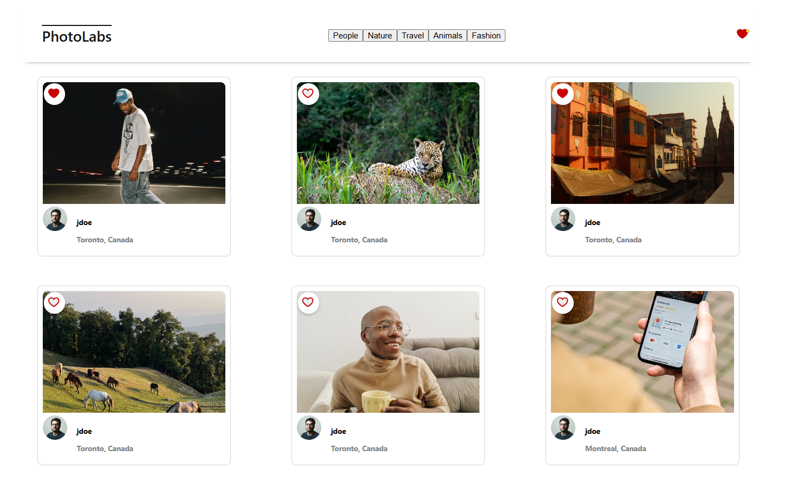
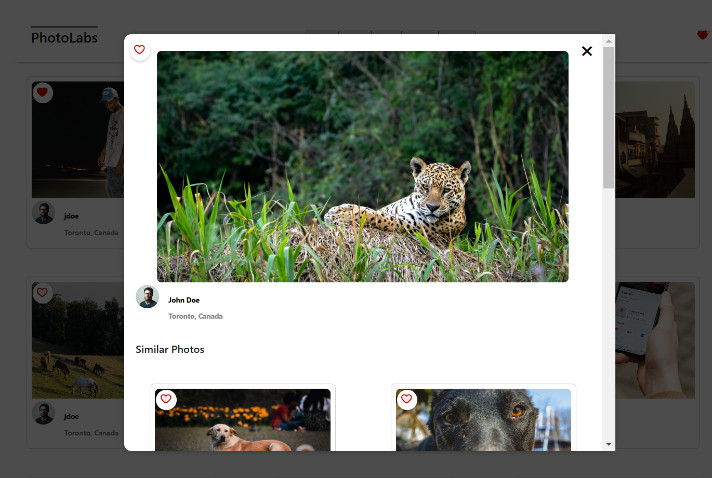
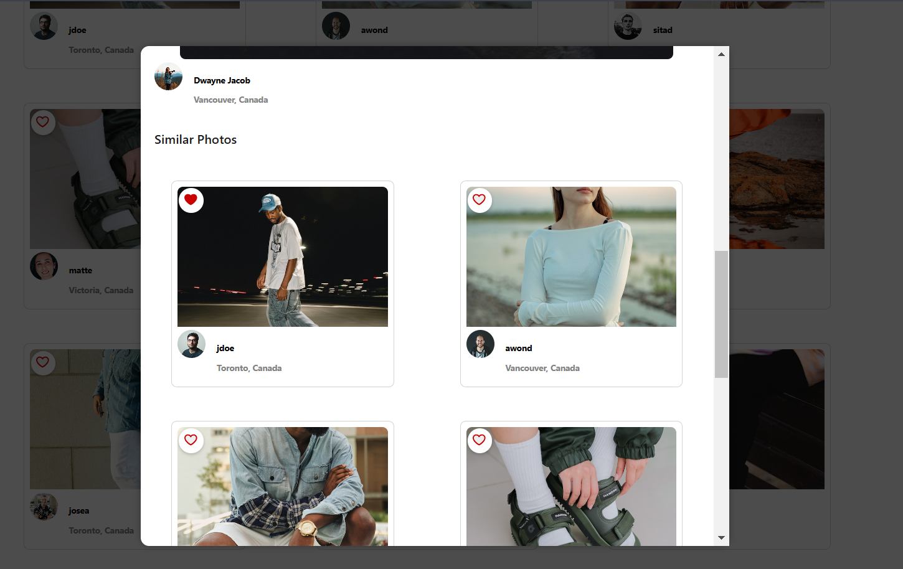

# 📸 PhotoLabs

A modern React-based photo gallery application where users can explore images by categories, view high-resolution versions, and favorite their favorite images.

---

## ✨ Features
- 🔍 **Browse Photos:** View a collection of high-quality images fetched from an API.
- 🎭 **Photo Categories:** Filter images by selecting different topics from the navigation bar.
- 💖 **Favorite Photos:** Click the heart icon to favorite or unfavorite photos, which updates across the app.
- 🖼️ **Photo Details Modal:** Click on any photo to open a modal with a larger view and additional details.
- 📌 **Similar Photos:** See similar images in the modal for better discovery.

---

## ⚙️ Setup

[Backend Setup Instructions](/backend/)

[Frontend Setup Instructions](/frontend/)

---

## 🫣 A Sneak Peak At PhotoLabs 

